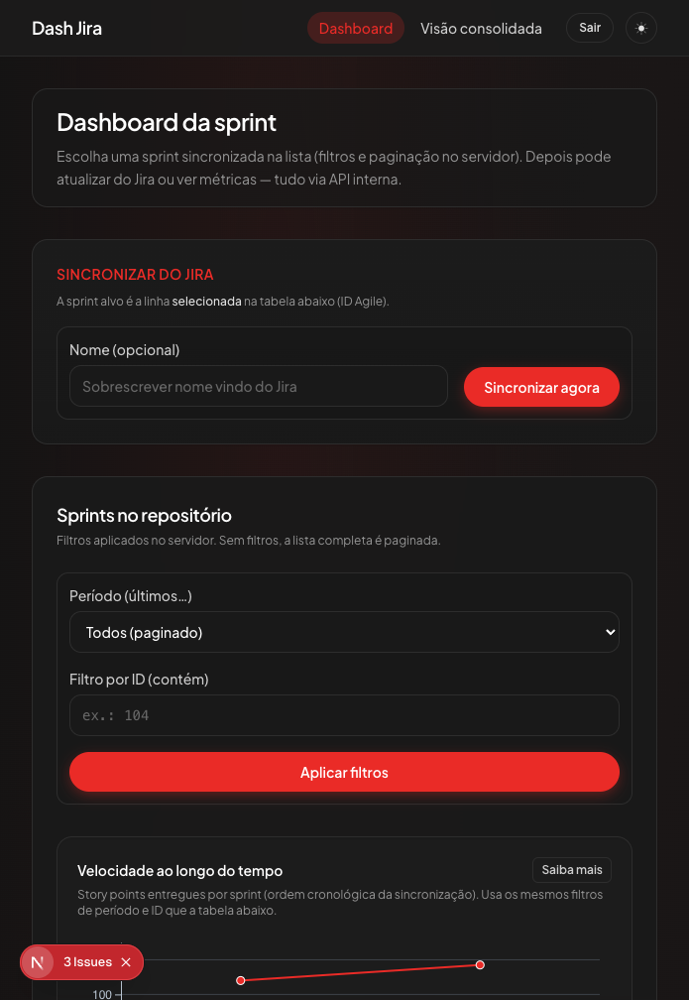
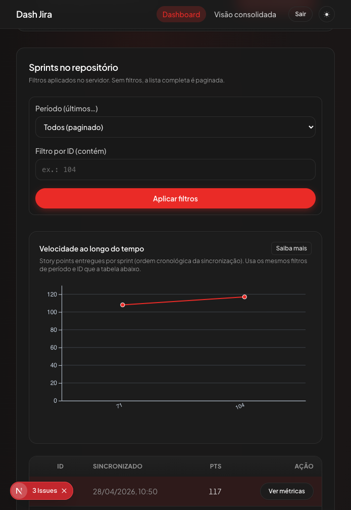
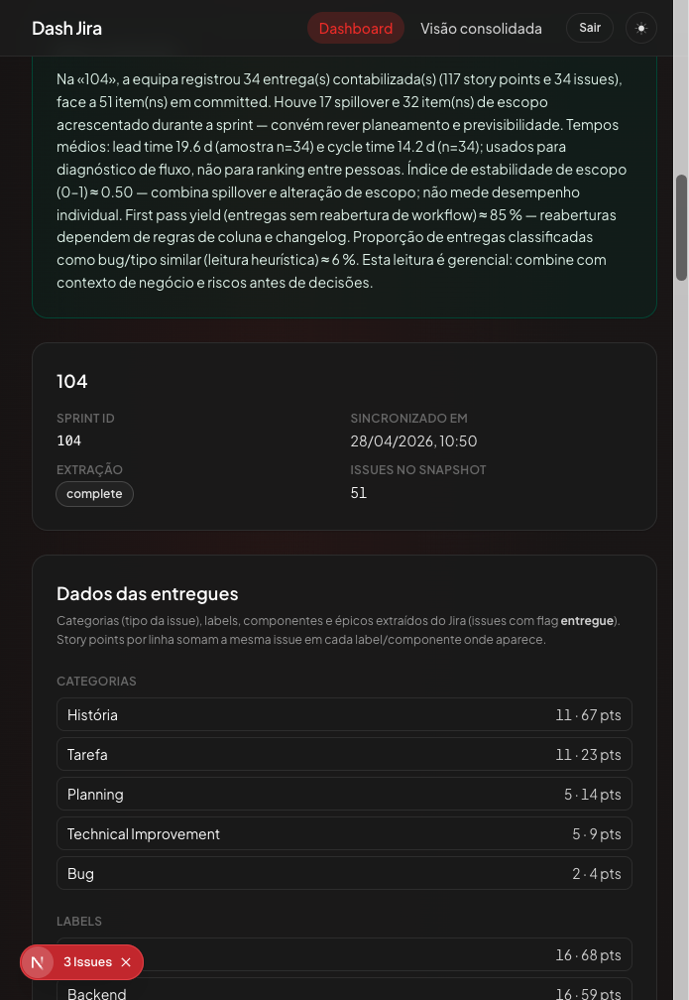
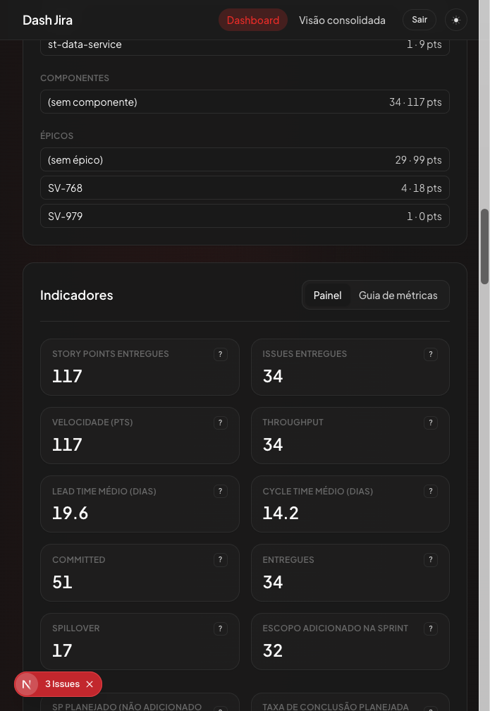
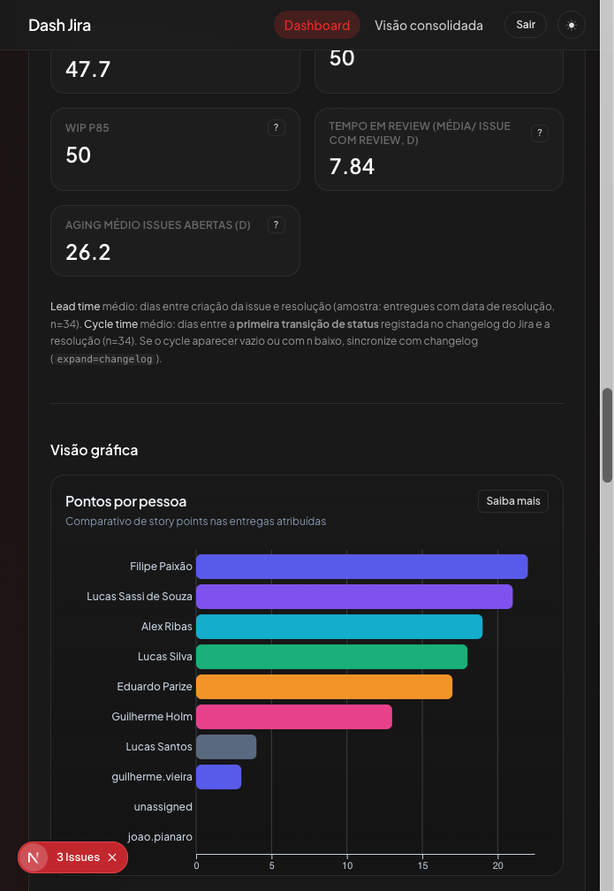
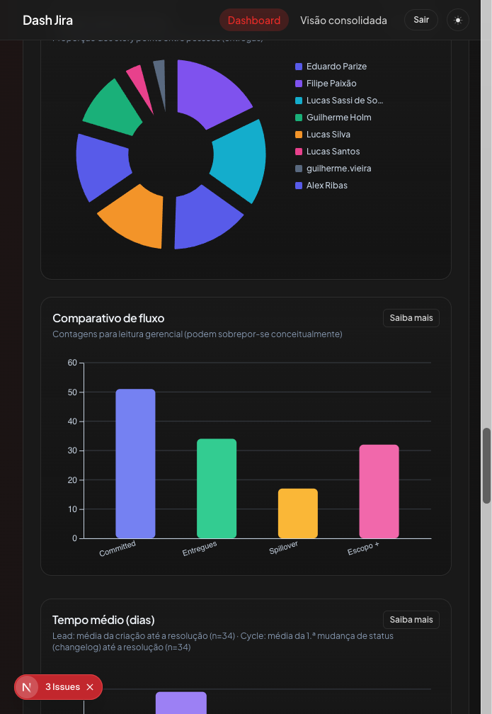
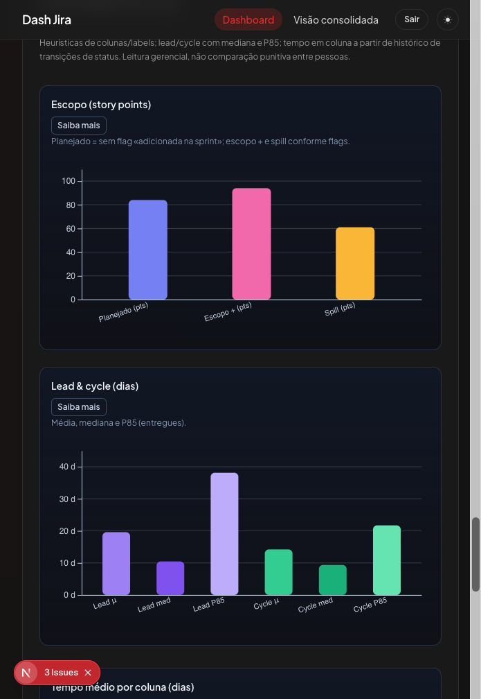
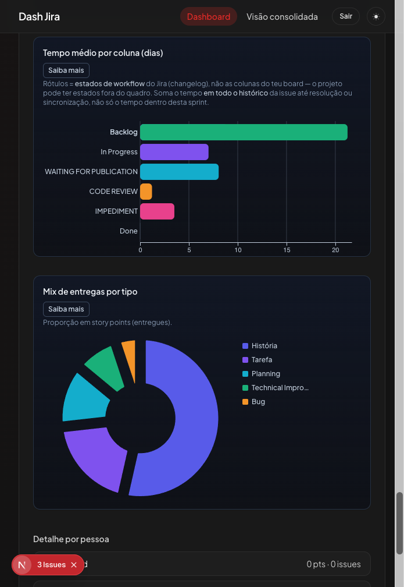

# Guia do Dashboard Jira — como ler e usar a interface

Este guia é pensado para **quem usa o painel no dia a dia**: gestao de produto, engenharia, Scrum Masters e qualquer pessoa que precise **entender o que cada numero e cada grafico esta a dizer**, sem precisar de ser programador.

No final ha um **apendice breve** so para quem precisa de instalar ou desenvolver o sistema localmente.

---

## O que e este dashboard, em uma frase

E uma **vitrine unica** dos dados da vossa sprint que ja foram sincronizados a partir do Jira: quanto foi entregue, em quanto tempo, com que estabilidade de plano e onde o trabalho "demora mais". Os dados vem do historico das issues no Jira; **atualizar** e escolher a sprint e carregar em **Sincronizar agora**.

---

## Como navegar no painel (fluxo tipico)

1. Entras em **Dashboard**.
2. Ves a lista **Sprints no repositorio** - sao as sprints que ja foram sincronizadas pelo menos uma vez.
3. Podes **filtrar** por periodo ou por ID de sprint e clicar em **Aplicar filtros**.
4. Na zona **Velocidade ao longo do tempo** ves a linha de tendencia dos pontos entregues (serve para comparar sprints ao longo do tempo).
5. Na tabela, escolhes uma linha e clicas **Ver metricas** para abrir o **detalhe dessa sprint**.
6. No detalhe aparecem: **resumo em texto**, **cards com numeros**, separadores **Painel** / **Guia de metricas**, e mais abaixo os **graficos**.
7. Em cada numero ou grafico podes usar **?** ou **Saiba mais** para abrir uma explicacao no ecra.

---

## Glossario — palavras que aparecem no ecra

| Termo no dashboard | O que significa em linguagem simples |
| --- | --- |
| **Story points (pts)** | Estimativa de esforco relativo do trabalho (nao sao horas). Serve para comparar "peso" das issues entre si. |
| **Issue** | Um cartao de trabalho no Jira (historia, tarefa, bug, etc.). |
| **Velocidade** | Quantos pontos o time **efetivamente entregou** na sprint (ou media ao longo de varias sprints). Ajuda a planear "quanto cabe" na proxima iteracao. |
| **Throughput** | Quantas issues foram **concluidas** no periodo. E "quantidade de itens", nao pontos. |
| **Committed** | Issues que estavam no compromisso inicial da sprint (planeadas desde o inicio). |
| **Entregues** | Issues que ficaram **feitas** dentro da sprint. |
| **Spillover** | Issues que **nao terminaram** e passaram para outra sprint (ou ficaram por fechar). |
| **Escopo adicionado / Escopo +** | Issues **entradas ou acrescentadas depois** do arranque da sprint — mudancas de plano a meio do periodo. |
| **Lead time** | Tempo total desde o pedido existir (issue criada) ate estar **resolvida**. Inclui esperas na fila e antes de alguem pegar no trabalho. |
| **Cycle time** | Tempo desde o trabalho **comecar de facto** (primeira mudanca relevante de estado no historico) ate a **resolucao**. Mede o fluxo de execucao. |
| **Media** | Valor "tipico" se somarmos tudo e dividirmos; pode ser puxado para cima por poucos casos muito lentos. |
| **Mediana** | Valor do meio: metade das issues demora menos, metade demora mais. Costuma ser mais estavel que a media. |
| **P85** | "Percentil 85": num conjunto de tempos, **85% das issues** terminaram ate esse valor; os 15% mais lentos ficam acima. Ajuda a ver a **cauda** do atraso. |
| **WIP (Work In Progress)** | Quantas issues estao **em progresso ao mesmo tempo**. Muitas em paralelo tendem a aumentar o tempo de cada uma. |
| **WIP P85** | Um patamar alto de simultaneidade que se repete — nao e so um pico isolado. |
| **Eficiencia de fluxo** | Parte do tempo em que o item **esta realmente a avancar** frente ao tempo total nas etapas (esperas contam contra). |
| **First pass yield** | Percentagem de entregas que **nao voltaram atras** no fluxo depois de marcadas como feitas (menos reaberturas = mais "certo a primeira"). |
| **Bug rate** | Parte das entregas que sao bugs (por tipo de issue), para ver pressao corretiva vs novidades. |
| **Changelog / historico** | Registo de mudancas de estado da issue no Jira; e usado para tempos de ciclo e tempo por coluna. |

---

## Tour pela interface — cada imagem explicada

Abaixo segue **uma explicacao por captura de ecra**: o que estas a ver, como ler, e os termos que importam.

---

### Imagem 1 — Vista inicial do dashboard



**O que e esta zona**

E o **topo da pagina**: titulo, texto introdutorio, bloco **Sincronizar do Jira** e o inicio dos filtros da lista de sprints.

**Para que serve**

- **Sincronizar do Jira**: puxa dados frescos da sprint que esta **selecionada na tabela** (mais abaixo na mesma pagina). O campo **Nome (opcional)** so altera o nome mostrado localmente, nao muda o ID da sprint no Jira.
- Logo abaixo (na sequencia da pagina) estao os **filtros** para nao precisares de ver todas as sprints de uma vez - por exemplo so as ultimas 30 dias ou so IDs que contenham certos numeros.

**Como usar sem erro**

1. Primeiro escolhe uma sprint na **tabela** (clica **Ver metricas** ou seleciona a linha).
2. Depois, se quiseres dados novos do Jira, usa **Sincronizar agora**.

**Termos que podes ver aqui**

- **ID Agile / Sprint ID**: identificador numerico da sprint no Jira - e o que liga o botao de sincronizacao a sprint certa.

---

### Imagem 2 — Velocidade ao longo do tempo e tabela de sprints



**O que e esta zona**

- **Velocidade ao longo do tempo**: grafico de **linha** com story points entregues por sprint, na ordem em que as sprints foram sincronizadas no sistema.
- **Tabela**: cada linha e uma sprint guardada no repositorio, com nome, ID, data da ultima sincronizacao, pontos e botao **Ver metricas**.

**Como ler o grafico de linha**

- O eixo vertical sao **pontos entregues**; o horizontal sao **sprints** (rotulos curtos dos nomes).
- **Subida ou descida** da linha sugere mais ou menos capacidade entregue entre periodos - mas **sempre** combina com contexto: equipa diferente, feriados, bugs urgentes ou mudanca de escopo podem explicar picos.

**O botao "Saiba mais"** ao lado do titulo do grafico abre texto sobre o que e tendencia de velocidade e o que **nao** deve ser inferido de um unico ponto.

**Termos**

- **Sincronizado**: momento em que os dados foram guardados neste dashboard - nao e necessariamente o fim da sprint no calendario.

---

### Imagem 3 — Resumo executivo e metadados das entregues



**O que e esta zona**

Quando abres uma sprint com **Ver metricas**, aparece primeiro um **texto de resumo** (caixa verde, quando existe) e uma area **Dados das entregues** com tabelas por categorias, labels, componentes e epicos.

**Como ler**

- O **resumo executivo** junta num paragrafo: quantas issues foram entregues, compromisso vs entrega, spillover, escopo novo, tempos medios e alguns indices de qualidade. E a leitura "para alguem com 30 segundos".
- **Categorias / Labels / Componentes / Epicos**: mostram **onde foi parar o esforco** em pontos e em numero de issues. Uma mesma issue pode contar em mais do que uma linha se tiver varias etiquetas - por isso os numeros sao por dimensao, nao um unico total duplicavel linha a linha.

**Termos**

- **Issues no snapshot**: quantas issues entraram no "recorte" analisado dessa sincronizacao.

---

### Imagem 4 — Separador Painel e primeiros cards de indicadores



**O que e esta zona**

E o separador **Painel** dentro de **Indicadores**, com **cards** (caixas) numericos: story points, issues, velocidade, throughput, tempos medios, committed, entregues, spillover e escopo adicionado.

**Como usar**

- Cada card tem um **?** que abre uma janela com explicacao especifica daquele numero.
- Os primeiros cards respondem a "**quanto entregamos**?" e "**em quanto tempo em media**?" (lead e cycle).
- Os seguintes respondem a "**o plano manteve-se**?" (committed vs entregues), "**o que ficou para tras**?" (spillover) e "**entrou trabalho a meio da sprint**?" (escopo adicionado).

**Lead vs Cycle (lembrete rapido)**

- **Lead alto** com **cycle mais baixo**: muito tempo a espera antes de comecar — filas, priorizacao, dependencias.
- **Ambos altos**: gargalo durante a execucao (revisoes, testes, bloqueios).

---

### Imagem 5 — Mais cards e inicio dos graficos (pontos por pessoa)



**O que e esta zona**

Continuacao dos cards (metricas avancadas como taxa de conclusao planeada, estabilidade, first pass yield, WIP, tendencias, etc.) e o arranque da secao **Visao grafica**, tipicamente com **Pontos por pessoa**.

**Como ler "Pontos por pessoa"**

- Barras horizontais: cada barra e uma pessoa e o comprimento sao **story points** das entregas atribuidas a essa pessoa na sprint.
- **Uso saudavel**: perceber distribuicao de carga e se ha concentracao excessiva em poucas pessoas.
- **Uso a evitar**: ranking tipo "quem e melhor" — story points nao medem valor individual nem produtividade isolada.

**Termos nos cards**

- **Taxa de conclusao planeada**: dos pontos que tinham sido planeados, que parte efetivamente entregue.
- **Indice de estabilidade**: numero sintetico (0 a 1); valores mais altos costumam indicar sprint menos "abalada" por spillover e mudancas de escopo (sempre no contexto da vossa formula).
- **Tempo em review**: media de dias em revisao nas issues que passaram por essa etapa.
- **Aging medio issues abertas**: ha quanto tempo em media as issues ainda abertas existem — alerta de acumulo.

---

### Imagem 6 — Donut, comparativo de fluxo e Lead x Cycle



**O que e cada grafico**

1. **Distribuicao de pontos (donut)**  
   Partes do circulo = percentagem dos **pontos entregues** por pessoa. O centro costuma reforcar que e sobre pontos, nao sobre numero de issues.
2. **Comparativo de fluxo (colunas)**  
   Quatro barras: **Committed**, **Entregues**, **Spillover**, **Escopo +**. Ajuda a conversa de retrospetiva: "prometemos X, entregamos Y, quanto ficou para a proxima sprint e quanto entrou a meio?"  
   O proprio painel avisa que estas contagens **podem sobrepor-se em conceito** — ou seja, sao leituras gerenciais, nao um puzzle matematico onde todas as pecas somam um unico total obvio sem definicao.
3. **Tempo medio (dias) — Lead x Cycle**  
   Duas barras lado a lado com medias em dias. Se a barra de **Lead** for muito maior que **Cycle**, grande parte do atraso esta **antes** do trabalho "andar" (fila, priorizacao).

---

### Imagem 7 — Escopo em pontos e Lead & Cycle com media, mediana e P85



**Grafico "Escopo (story points)"**

- Tres barras: **Planejado**, **Escopo +**, **Spill** (spillover em pontos).
- Texto no cartao explica a logica: planejado sem flag de "adicionada na sprint"; escopo + e spill conforme **flags** do modelo de dados.

**Grafico "Lead & cycle (dias)"**

- Ate seis barras: para **Lead** e **Cycle**, aparecem **media**, **mediana** e **P85**.
- **Interpretacao pratica**:
  - Se **media** e **mediana** estao proximas, o tempo e relativamente uniforme.
  - Se **media** esta muito acima da **mediana**, ha **outliers** — poucas issues muito lentas a puxar a media para cima.
  - Se **P85** e muito alto, uma fatia relevante do trabalho demora **bem mais** que o "normal" — vale investigar essas issues.

---

### Imagem 8 — Tempo por "coluna" e mix por tipo de issue



**"Tempo medio por coluna (dias)"**

- Barras horizontais por **estado do fluxo de trabalho** (ex.: Backlog, Em progresso, Code review), calculado a partir do **historico de mudancas de estado** no Jira.
- **Importante**: nao e o mesmo que "colunas do quadro Kanban desenhadas a mao". Estados podem existir no workflow e nem sempre aparecem como coluna visual — o grafico segue **estados e tempo registados no historico**.
- O texto tambem explica que pode somar tempo **no historico completo** da issue ate resolucao ou sincronizacao, nao so "dentro desta sprint", conforme a definicao implementada no produto.

**"Mix de entregas por tipo"**

- Donut com proporcao de **story points** por **tipo de issue** (Historia, Tarefa, Bug, ...).
- Ajuda a ver equilibrio entre **novas funcionalidades**, **correcoes** e **melhorias tecnicas**.

---

## Outros elementos uteis no mesmo ecra

- **Separador "Guia de metricas"**: texto estatico que lista metricas e graficos **mesmo sem** sprint carregada; quando ha sprint, complementa o Painel.
- **Explain modal (? / Saiba mais)**: explicacoes longas numa janela centrada — util para partilhar ecra em revisoes.

---

## Boas praticas — ler numeros com juizo

- Comparar **varias sprints**, nao julgar uma sprint isolada sem contexto.
- Cruzar **entrega** (pontos/issues) com **tempo** (lead/cycle) e **estabilidade** (escopo/spillover).
- Usar graficos por pessoa para **distribuicao e risco de sobrecarga**, nao para ranking de performance individual.

---

## Checklist — so para usar o dashboard no dia a dia

- Escolher sprint na lista e abrir **Ver metricas**
- Ler o **resumo executivo** (se existir)
- Percorrer os **cards** com ajuda do **?**
- Descer aos **graficos** e usar **Saiba mais** onde houver duvida
- Se os dados estiverem desatualizados, **Sincronizar agora** com a sprint certa selecionada

---

## Apendice A — Instalacao e ambiente (equipa tecnica)

### Pre-requisitos

Node.js 20+, npm, MongoDB acessivel, credenciais Jira (URL, e-mail e API token).

### Variaveis em `.env.local`

```bash
MONGODB_URI=mongodb://localhost:27017
MONGODB_DB=dash_jira

JIRA_BASE_URL=https://seu-dominio.atlassian.net
JIRA_EMAIL=seu-email@empresa.com
JIRA_API_TOKEN=seu_token

AUTH_SECRET=um_segredo_forte
NEXTAUTH_URL=http://localhost:3000
```

### Comandos

```bash
npm install
npm run dev
```

App local: `http://localhost:3000`

Validacao tipica de projeto: `npm run lint`, `npm run test`, `npm run build`. Opcional: `npm run validate:jira` para checks de paridade com dados Jira.

### Fluxo tecnico resumido

Sincronizacao manual escolhe sprint -> backend le Jira -> calcula metricas -> grava em MongoDB -> o dashboard le so pela API interna.

---

## Apendice B — Referencias para aprofundar conceitos

- Atlassian — Control Chart (lead/cycle): [https://support.atlassian.com/jira-software-cloud/docs/view-and-understand-the-control-chart](https://support.atlassian.com/jira-software-cloud/docs/view-and-understand-the-control-chart)
- Atlassian — Velocity Chart: [https://support.atlassian.com/jira-software-cloud/docs/view-and-understand-the-velocity-chart/](https://support.atlassian.com/jira-software-cloud/docs/view-and-understand-the-velocity-chart/)
- Atlassian — metricas Kanban (lead, cycle, WIP, throughput): [https://www.atlassian.com/agile/project-management/kanban-metrics](https://www.atlassian.com/agile/project-management/kanban-metrics)
- Atlassian — limites de WIP: [https://www.atlassian.com/en/agile/kanban/wip-limits](https://www.atlassian.com/en/agile/kanban/wip-limits)

Estas ligacoes ajudam a rever **definicoes** industriais; os numeros no vosso dashboard seguem as regras implementadas na aplicacao e podem diferir em detalhe das ferramentas nativas do Jira.
# React + TypeScript + Vite

This template provides a minimal setup to get React working in Vite with HMR and some ESLint rules.

Currently, two official plugins are available:

- [@vitejs/plugin-react](https://github.com/vitejs/vite-plugin-react/blob/main/packages/plugin-react) uses [Oxc](https://oxc.rs)
- [@vitejs/plugin-react-swc](https://github.com/vitejs/vite-plugin-react/blob/main/packages/plugin-react-swc) uses [SWC](https://swc.rs/)

## React Compiler

The React Compiler is not enabled on this template because of its impact on dev & build performances. To add it, see [this documentation](https://react.dev/learn/react-compiler/installation).

## Expanding the ESLint configuration

If you are developing a production application, we recommend updating the configuration to enable type-aware lint rules:

```js
export default defineConfig([
  globalIgnores(['dist']),
  {
    files: ['**/*.{ts,tsx}'],
    extends: [
      // Other configs...

      // Remove tseslint.configs.recommended and replace with this
      tseslint.configs.recommendedTypeChecked,
      // Alternatively, use this for stricter rules
      tseslint.configs.strictTypeChecked,
      // Optionally, add this for stylistic rules
      tseslint.configs.stylisticTypeChecked,

      // Other configs...
    ],
    languageOptions: {
      parserOptions: {
        project: ['./tsconfig.node.json', './tsconfig.app.json'],
        tsconfigRootDir: import.meta.dirname,
      },
      // other options...
    },
  },
])
```

You can also install [eslint-plugin-react-x](https://github.com/Rel1cx/eslint-react/tree/main/packages/plugins/eslint-plugin-react-x) and [eslint-plugin-react-dom](https://github.com/Rel1cx/eslint-react/tree/main/packages/plugins/eslint-plugin-react-dom) for React-specific lint rules:

```js
// eslint.config.js
import reactX from 'eslint-plugin-react-x'
import reactDom from 'eslint-plugin-react-dom'

export default defineConfig([
  globalIgnores(['dist']),
  {
    files: ['**/*.{ts,tsx}'],
    extends: [
      // Other configs...
      // Enable lint rules for React
      reactX.configs['recommended-typescript'],
      // Enable lint rules for React DOM
      reactDom.configs.recommended,
    ],
    languageOptions: {
      parserOptions: {
        project: ['./tsconfig.node.json', './tsconfig.app.json'],
        tsconfigRootDir: import.meta.dirname,
      },
      // other options...
    },
  },
])
```

# jira-dashboard

